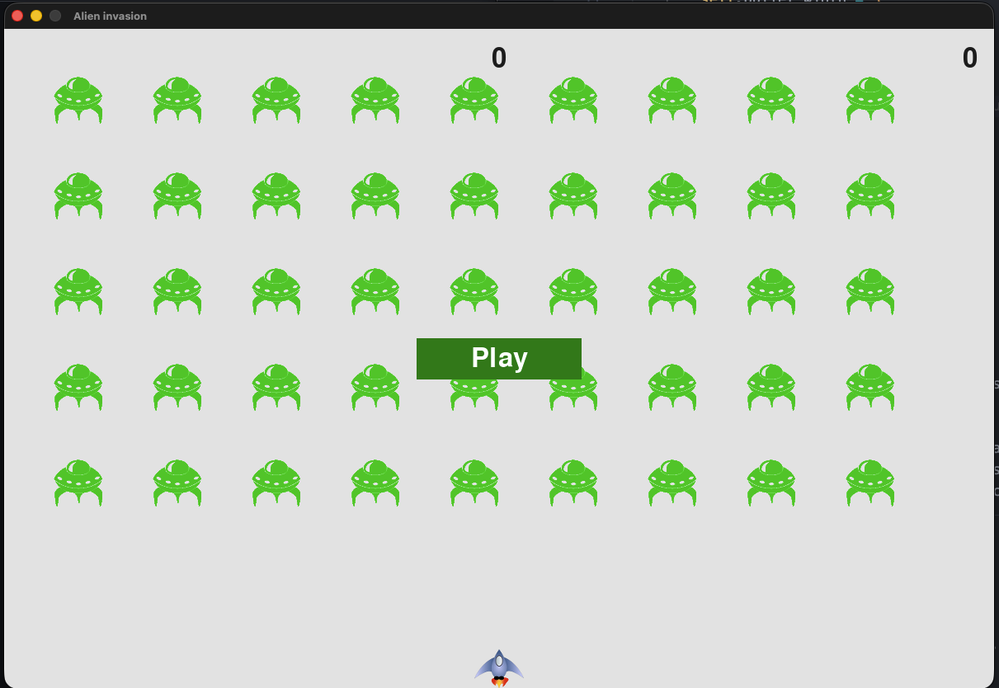
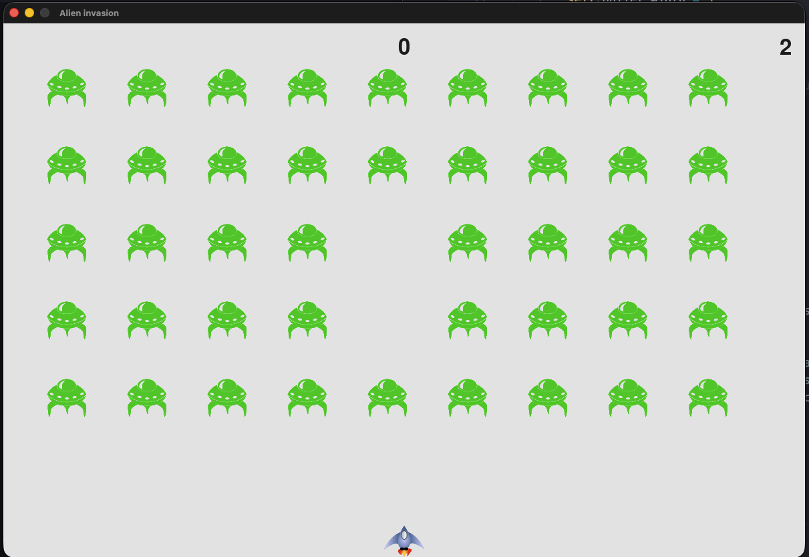
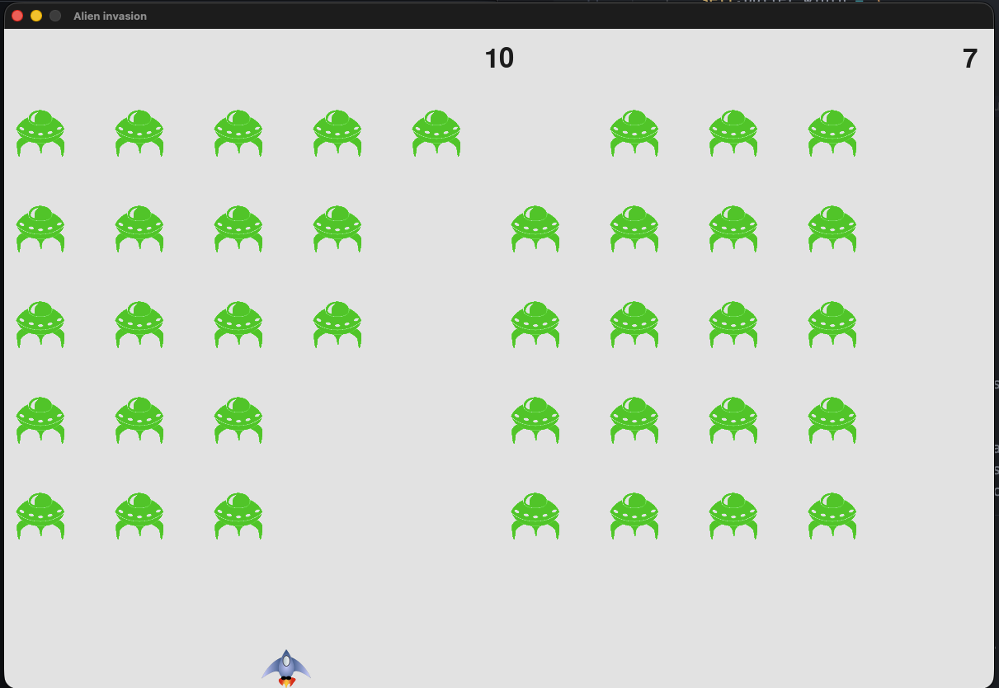

# Alien Invasion

A simple 2D arcade-style game built with Python and Pygame.

## Description
The player controls a ship at the bottom of the screen. The goal is to shoot down descending fleets of aliens before they reach the ship or the bottom of the screen.

## Screenshots




## Requirements
- Python 3.x
- Pygame

## Installation
1. Clone the repository.
2. Install Pygame:
   ```bash
   pip install pygame
   ```

## How to Run
Run the main game script:
```bash
python alien_invasion.py
```

## Controls
- **Left/Right Arrow**: Move the ship.
- **Spacebar**: Fire bullets.
- **Q**: Quit the game.

## Customization
You can adjust various game settings in `settings.py`:
- **Ship Speed**: Modify `self.ship_speed`.
- **Bullet Speed**: Modify `self.bullet_speed`.
- **Alien Speed**: Modify `self.alien_speed`.
- **Fleet Drop Speed**: Modify `self.fleet_drop_speed`.
- **Screen Dimensions**: Update `self.screen_width` and `self.screen_height`.
